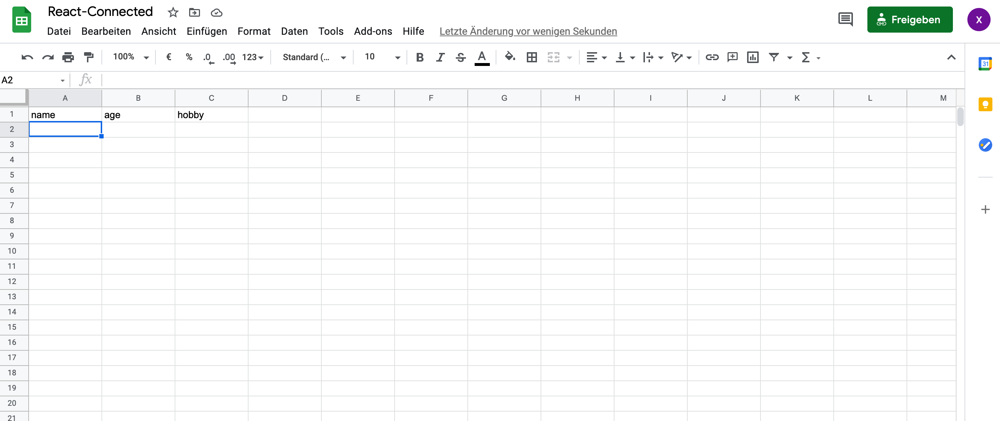
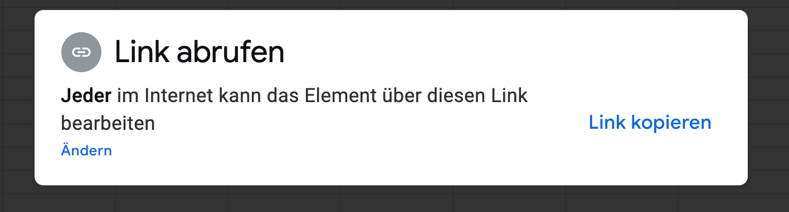
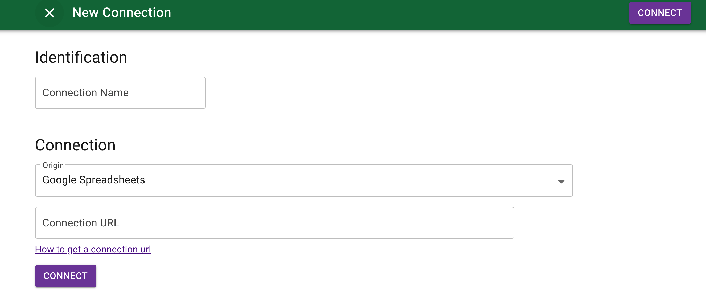
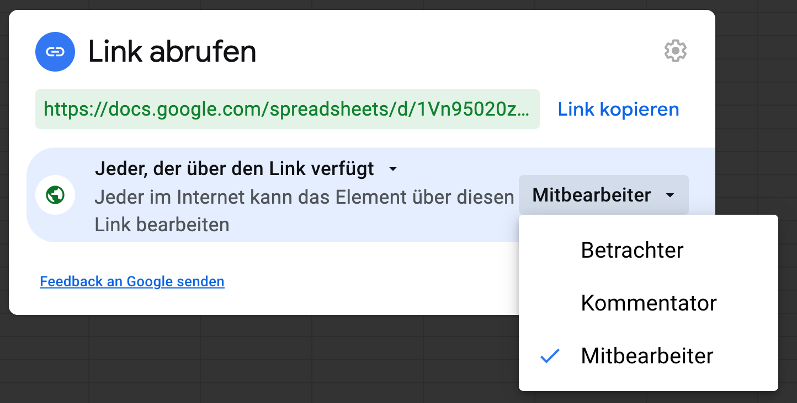

# React-Google-Sheets

**This is a simple react Application, it turns Google Sheets into a REST API and use it with this Application**

<hr />

## Getting started

```jsx
git clone https://github.com/xiaominzhu88/react-google-sheets.git
```

**or**

create your own projects use

```jsx
npx create-react-app your-project-name
```

<hr>

## Dependencie Packages: (not required\*)

- [reakit](https://reakit.io/)
- [node-sass](https://www.npmjs.com/package/node-sass)
- [axios](https://www.npmjs.com/package/axios)

```jsx
yarn add reakit
// a lower level component library for building accessible high level UI libraries, design systems and applications with React

yarn add node-sass

yarn add axios
// promise based HTTP client for the browser and node.js
```

<hr />

## Change Google sheets into a REST API

<ins>_I'm using german version 🧚‍♀️_</ins>

- Open a new google Spreadsheet by clicking File, create new Spreadsheet and give it a name



- Click on the share button on the top right of screen, and edit the permission to public, copy the link



- Go to [sheet.best](https://sheet.best/) and create a free account, create a new connection and paste copied URL from the Google Sheets in the connection URL box.



- Click on "connect you will be redirected to your connections page, Click on the details of your new connection and copy the CONNECTION URL, yeah, this is your endpoint URL

👆 If you want to use our APIs to modify the Sheet, like make "POST" or "PUT".. request in your App, you'll also need to provide edit access for the Sheet



💥 **Important, otherwise you will receive a request error like "connection doesn't exist or is not shared correctly...", it took me 2 hours to figure it out** 💥

- Fill out the request key value in google sheet input fields (like the first image above), run App and you'll see that the data is getting populated into your Google Sheets one by one.

## 🌻 That's it!

<hr />

## Available Scripts

In the project directory, you can run:

### `yarn start`

Runs the app in the development mode.\
Open [http://localhost:3000](http://localhost:3000) to view it in the browser.

The page will reload if you make edits.\
You will also see any lint errors in the console.

### `yarn test`

Launches the test runner in the interactive watch mode.\
See the section about [running tests](https://facebook.github.io/create-react-app/docs/running-tests) for more information.

### `yarn build`

Builds the app for production to the `build` folder.\
It correctly bundles React in production mode and optimizes the build for the best performance.

The build is minified and the filenames include the hashes.\
Your app is ready to be deployed!

See the section about [deployment](https://facebook.github.io/create-react-app/docs/deployment) for more information.

### `yarn eject`

**Note: this is a one-way operation. Once you `eject`, you can’t go back!**

If you aren’t satisfied with the build tool and configuration choices, you can `eject` at any time. This command will remove the single build dependency from your project.

Instead, it will copy all the configuration files and the transitive dependencies (webpack, Babel, ESLint, etc) right into your project so you have full control over them. All of the commands except `eject` will still work, but they will point to the copied scripts so you can tweak them. At this point you’re on your own.

You don’t have to ever use `eject`. The curated feature set is suitable for small and middle deployments, and you shouldn’t feel obligated to use this feature. However we understand that this tool wouldn’t be useful if you couldn’t customize it when you are ready for it.
